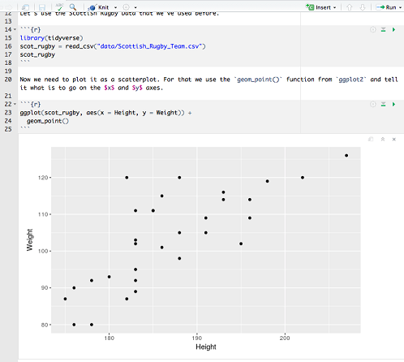

```{r my_setup, include = F}
# this knit_hooks$set allows for an additional argument
# verbatim = TRUE
# which if present, is then removed but the chunk is printed out
# including the backticks and arguments
knitr::knit_hooks$set(source = function(x, options) {
  if (!is.null(options$verbatim) && options$verbatim) {
    opts = gsub(",\\s*verbatim\\s*=\\s*TRUE\\s*", "", options$params.src)
    bef = sprintf('\n\n    ```{r %s}\n', opts, "\n")
    stringr::str_c(
      bef, 
      knitr:::indent_block(paste(x, collapse = '\n'), "    "), 
      "\n    ```\n"
    )
  } else {
    stringr::str_c("\n\n```", tolower(options$engine), "\n", 
      paste(x, collapse = '\n'), "\n```\n\n"
    )
  }
})

# function to get inline R chunk from stackoverflow
# http://stackoverflow.com/questions/20409172/how-to-display-verbatim-inline-r-code-with-backticks-using-rmarkdown
rinline <- function(code) {
  sprintf('``` `r %s` ```', code)
}

# setting default options to include verbatim = TRUE
knitr::opts_chunk$set(echo = TRUE, eval = TRUE, warning = FALSE,
                      message = FALSE, comment = NA)
```

_**Address:** Inverness College UHI, 1 Inverness Campus, Inverness, IV2 5NA_

_**Email:** [andrew.duncan.ic@uhi.ac.uk](mailto:andrew.duncan.ic@uhi.ac.uk)_


# Introduction

Increasingly in recent times there has been a change in outlook when it comes to teaching statistics in schools, colleges and universities. There is a movement toward using software and teaching students using data and case studies (@Baumer2014, @Bray2014, @Hicks2016, @Wang2017, @Wilson2016). This change is also apparent in the introduction of a new statistics unit at SCQF level 6 by the Scottish Qualifications Authority, developed with input from the University of Strathclyde (@SQA_level6). This unit requires students to complete linear regression and a basic hypothesis test using computer software and several examples of possible software are provided. 

Alongside this change in the teaching of statistics is an increasing desire in the scientific community for reproducible research. This is highlighted by the articles collated by Nature on the topic of reprodocible research (@Nature_repro_special) and several books that have been published on the topic (for example - @Stodden2014). 

One of the tools that can be used to satisfy both the change in statistics teaching whilst encouraging reproducibility is the statistical software R (@baseR). R is an increasingly popular tool (@Muenchen2017) and widely taught in Universities (@Baumer2014). The integrated development environment RStudio (@RStudio) can be used to help with reproducibility (@Gandrud2015) and personal experience has shown that it can help when introducing students to R. One of the tools to assist with reproducbile research is R Markdown (@rmarkdown_package) as it allows for R code chunks to be integrated alongside plain text, avoiding the problem where the calculation of results is separated from any interpretation. 

This article will outline some of the advantages and associated challenges in using R Markdown, and its extensions, in teaching statistics and data analysis.

# R Markdown

One of the benefits of R is that the functionality provided by the normal "base" install can be extended by packages. These provide additional capabilities, are written by other users and like R itself are open source. One such package is the R Markdown package (@rmarkdown_package). The R Markdown package allows users to convert R Markdown documents into several other possible forms.

An R Markdown document is based on the Markdown markup language (@markdown) which takes a plain text document and produces a HyperText Markup Language (html) file. R Markdown uses the same syntax but allows users to include R code chunks. R Markdown also allows users to include LaTeX syntax (@LaTeX) to create mathematical expressions with the normal single dollar signs `$x^2$` producing $x^2$ and two dollar symbols (e.g. `$$e^{i\pi} + 1 = 0 $$`) producing an equation. 

$$e^{i\pi} + 1 = 0 $$

If the equation needs to be numbered (and referenced) you can use the standard `\begin{equation}` and `\end{equation}` and add a label using `(\#eq:label)`. This could produce something like equation \@ref(eq:binom)

\begin{equation}
f\left(k\right) = \binom{n}{k} p^k\left(1-p\right)^{n-k}
\:\:\:\:\:
(\#eq:binom)
\end{equation}

which can be referenced using `\@ref(eq:label)`.

Once users have finished creating their R Markdown document they can **render**/**knit** [^1] it into, (amongst other formats) HTML, Word or PDF[^2].

## R Markdown Syntax

There are many suitable guides for the R Markdown syntax but I include a few here to demonstrate the capabilities. 

You can insert R code inline using single backticks `` `r '\x60r 2 + 2\x60'` `` and multiple lines using a chunk

```{r example-plot, verbatim = TRUE, fig.cap = "Example output plot"}
library(tidyverse)
# create subset of data
diamonds = sample_n(diamonds, 10000)
# plot carat vs price
ggplot(diamonds, aes(x = carat, y = price)) +
  geom_point()
```

which will produce figure \@ref(fig:example-plot).


Most simple inline formatting is available. For example:

   - `_italic_` or `*italic*` produces _italic_ or *italic*
  
   - `__bold__` or `**italic**` produces __bold__ or **bold**
  
   - `R^2^` provides superscript R^2^ with `R~2~` providing subscript R~2~
  
   - `` allows you to insert an image

   - `[link to R Markdown website](http://rmarkdown.rstudio.com)` [link to R Markdown website](http://rmarkdown.rstudio.com) produces a hyperlink.

Lists can also be produced, but there but be a blank line between the previous paragraph and the list:

   - Numbered lists 

```
1. item 1
2. item 2
  i subitem i
  ii. subitem ii
3. item 3
```

  1. item 1
  2. item 2
    i. subitem i
    ii. subitem ii
  3. item 3


  - Other lists 

```
- item 1
- item 2
  - subitem i
  - subitem ii
- item 3
```

  - item 1
  - item 2
    - subitem i
    - subitem ii
  - item 3

One point to note is that things will render slightly differently in the different output formats (HTML, Word and PDF) that are possible. 

# Benefits of using R Markdown in the classroom

One of the major benefits of using a system like R Markdown is that a student's work is contained within one document. It is no longer necessary to create graphs and import them into their write up. This applies to any subject where they have data analysis to present, it need not be limited to statistics. If the data is in an Excel spreadsheet (or similar) it can be imported into R and the plots created and displayed to the students as they continue to edit their report as seen in figure \@ref(fig:inline-plot).

```{r inline-plot, echo = FALSE, eval = TRUE, fig.cap="An example of a plot appearing beside the code used to produce it."}

``` 

As mentioned earlier students can easily produce HTML files from R Markdown and there are several avenues through which these might be publised online for free[^3]. This can help the students take ownership of the work (@Bray2014). R Markdown can be used to build an entire website (an example can be found at [http://rmarkdown.rstudio.com/rmarkdown_websites.html](http://rmarkdown.rstudio.com/rmarkdown_websites.html)) or a blog (@blogdown_package, @blogdown_book). 

By learning R and R Markdown students are learning an increasingly popular computing language. Not only is it increasingly taught at Universities but it is a popular requested skill in various industries (@Muenchen2017).


# Benefits of using R Markdown as an educator

## In Assessment or Submission

Using R Markdown as a teacher/lecturer has several advantages compared to using, for example, Word and Excel, including for assessed or submitted work. If the student also submits the R Markdown document (and any associated data files if required) then, as when the student constructed it, the code used to create the results is right in the middle of the analysis. This makes marking easier and you can check whether the Word document they produced actually came from their R Markdown document, everything is reproducible (@Baumer2014).

As the R Markdown document can produce a Word or PDF document, this can be passed onto other members of staff to make second marking easier. They need not necessarily consider the R Markdown document itself.

## In Preparation of Materials

Depending on whether you have used LaTeX previously you may already have an opinion on the Word equation editor or similar and how easy it is to insert (and reference) equations using them, compared to producing and referencing equations in LaTeX. However, it may also be necessary, for whatever reason, to create a word document, rather than a PDF. R Markdown allows the use of LaTeX equations and for referencing we can call on the bookdown package (@bookdown_package, @bookdown_book). 

The bookdown package extends R Markdown and as the name suggests, it is designed to create books. By default the package will create an HTML book from a series of R Markdown documents. It can also create PDFs or several ebook formats, either in conjuction with the HTML (i.e. for download) or in isolation [@bookdown_book]. As with a single R Markdown file, if you wish to create a PDF a LaTeX distribution will need to be installed on the machine. 

Aside from creating books, the bookdown package increases some of the capability of R Markdown and can be used for individual R Markdown files, this includes adding the capabilities to reference figures (produced by R or inserted as an image), tables and equations[^4]. Sections or chapters can also be referenced later in the document. To get started the author of the package has produced two templates. One is a basic book template, the other contains additional files to produce a PDF in the same format as the bookdown book (@bookdown_demo, @bookdown_demo_crc, @bookdown_book).

One intention of bookdown is to allow public sharing with collaborative creation and editing of books (@bookdown_book). With that in mind several books have been created recently where either the publishers have allowed the online version to be available for free (@r4ds_book, @tidytext_book). There is also an introductory statistics book, available online, with the intention that it is reproduced and tweaked/extended by other teachers/lecturers (@moderndive_book). 

Two further advantages of using R, but not specifically R Markdown, is the availability of data already nicely formatted and normally available as a package. Examples include the gapminder and fivethiryeight packages (@gapminder_package, @538_package). The community of R users can provide an enormous amount of help and lots of free resources both for staff and students. 

# Examples of current use

@Baumer2014 has examples of usage and student feedback from courses at Duke University and Smith College. Student feedback was encouraging and lack of prior knowledge of markdown did not hinder students. It is also used in many other University courses including [STAT 545A and 547M](http://stat545.com/) at the University of British Columbia. 

# Difficulties of using R and R Markdown

Using R and R Markdown is not without their difficulties too. They work best with both R and RStudio installed. Although RStudio is not strictly necessary the buttons available for render/knit and additional ease of use that RStudio provide students/staff with additional assistance. In addition to the two pieces of software every user will need access to the same packages. All of this needs to be in place before students can begin. RStudio make a server version of their software which is also open source and this may be of use to ensure that all students have the same packages installed. 

There is a recommendation to use template R Markdown documents (@Baumer2014) which I would entirely agree with. It allows students to get started and some help can be given by including the start of an R chunk or examples of LaTeX equations. 

If there is a mistake in a R Markdown document then an error will be reported. Sometimes these error messages are unclear and this is where either teacher/lecturer experience is necessary or the R community will be extremely helpful. Students can be encouraged to find the solution themselves by using questions that others have already asked on websites like [stackoverflow](https://stackoverflow.com/questions/tagged/rmarkdown). 

# Conclusions

Reproducibility is seen as increasingly important in scientific research (Nature_repro_special). R along with R Markdown can help students to gain understanding and knowledge of the importance (and advantages of) reproducibility whilst learning about tools used in modern data science (@Baumer2014, @Muenchen2017). With the extension of R Markdown into the bookdown package, the advantages of equation editing and referencing from LaTeX can now be leveraged in a simpler document format and used in producing Word documents. 

# Appendix

The R Markdown document, template and BibTex file are available [online](https://github.com/aj2duncan/Rmd_Ed_Paper). To aide reproducibility the following setup was used to produce this article.

```{r, eval = TRUE}
sessionInfo()
```


# References


[^1]: **knit** because the knitr package (@knitr_package) is used in the process of creating the documents and RStudio provides uses with a button to render/knit the document. 
[^2]: To create a PDF file users need to have LaTeX installed. 
[^3]: Examples include [https://rpubs.com](https://rpubs.com), [https://pages.github.com](https://pages.github.com) and [https://www.netlify.com](https://www.netlify.com). For students the easiest of these would be RPubs as everything can be done with no additional software and by pushing a button in RStudio.
[^4]: Equation referencing works very well in PDF/HTML output but is a little fiddly in Microsoft Word. As seen in equation \@ref(eq:binom), it is perfectly possible though. 
